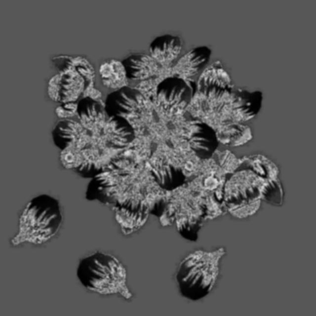

# FT Saliency In Opencl:The Sun's Getting Cold
---

## 1. Abstract
My Blog [http://www.xiaying73.com/](http://www.xiaying73.com/) 
Opencl-FT-Saliency-Algorithm is an open source software based on opencv-3.3.0 library and opencl1.2 in ubuntu-16.04, 
which focus on surface defect inspection with saliency filter. 

Open Source Computer Vision Library.[opencv https://opencv.org/](https://opencv.org/) 
Introduction about Opencl .[opencl https://en.wikipedia.org/wiki/OpenCL](https://en.wikipedia.org/wiki/OpenCL) 
Introduction about saliency .[saliency https://en.wikipedia.org/wiki/Salience_(neuroscience)](https://en.wikipedia.org/wiki/Salience_(neuroscience))   

## 2. Opencl kernels
You can find kernels of bgr2lab and reduction under the directory of kernels
### BGR2LAB
Converts BGR color space to LAB, detailed information about LAB color space can be found in [LAB https://en.wikipedia.org/wiki/CIELAB_color_space](https://en.wikipedia.org/wiki/CIELAB_color_space) 

### Reduction
Calculates the sum of every single channel with reduction algorithm in LAB color space.

## 3. Reduction's configuration
The total pixels of sample image is 102400 * 4(640*640).we set global work size:640, local work size: 64, then we can calculate the local groups, which is:640/64.The config file is located at **./include/config.h**.

## 4. Applications

### 4.1 Output of the algorithm

  
  

## 5. Contact

|Author          | Email            | Wechat      |
| ---------------|:----------------:| -----------:|
| chenzhengqiang | 642346572@qq.com | 18819373904 |

**Notice:  Any comments and suggestions are welcomed**

## 6. License
[Apache License 2.0](./LICENSE)
